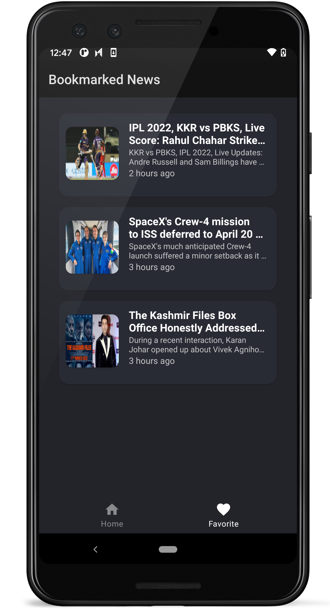

# NewsApp

**News Application** is basically a sample news app which is built to demonstrate the Android Architectural Components.

**You can Install and test latest OnlyNews app from below 👇**

## Screenshots 

## MAD Score

  

## About

It loads the news article using [news api](https://newsapi.org/). Using retrofit we fetch all the json data provided by the api and display on the user screen.

## Built With 🛠
- [Kotlin](https://kotlinlang.org/) - Programming language for Android development.
- [Coroutines](https://kotlinlang.org/docs/reference/coroutines-overview.html) - For asynchronous and more
- [Android Architecture Components](https://developer.android.com/topic/libraries/architecture) - Collection of libraries that help you design robust, testable, and maintainable apps.
    - [LiveData](https://developer.android.com/topic/libraries/architecture/livedata) - Data objects that notify views when the underlying database changes.
    - [ViewModel](https://developer.android.com/topic/libraries/architecture/viewmodel) - Stores UI-related data that isn't destroyed on UI changes.
    - [ViewDataBinding](https://developer.android.com/topic/libraries/view-binding) - Generates a binding class for each XML layout file present in that module and allows you to more easily write code that interacts with views.

- [Retrofit](https://square.github.io/retrofit/) - A type-safe HTTP client for Android and Java.
- [Dagger 2](https://developer.android.com/training/dependency-injection/dagger-android) - Dependency Framework - Dagger 2 ( Check - develop branch )
- [Dagger Hilt](https://developer.android.com/training/dependency-injection/hilt-android) - Dependency Framework - Dagger Hilt ( Check - dagger-hilt-migration branch )

## Architecture
This app uses [MVVM (Model View View-Model)](https://developer.android.com/jetpack/docs/guide#recommended-app-arch) architecture.

## Future Scope
1) Save News Functionality
2) Schedule auto pull news 
3) Add different news categories provided by newsapi.org 

## Contributing and reporting issues

You can to contribute in this repository. Just make pull request.

I appreciate any question or comment.
